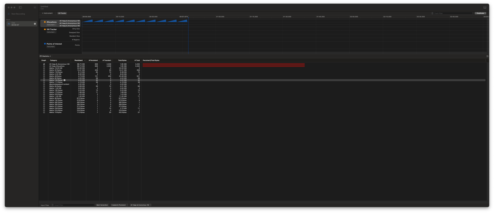

## How to use
1. Under this folder(CppDemo), compile and run `g++ -o CppDemo CppDemo.cpp`
2. Since I'm on Mac platform, I use build-in tool "Instrument" and then attach execution file in Instrument
3. Due to security issue in Mac, we have to re-sign the execution file with entitlements
`com.apple.security.get-task-allow = true`
4. Command to sign it again
`codesign -s - -f --entitlements "<FolderThatStoreEntitlements>/ent.plist" "<WorkingDirectory>/<ExecutionFile>"`
5. And then we won't encounter any issue of "failed to attach to the target process". failed to attach to the target process [See for details](https://github.com/cmyr/cargo-instruments/issues/40#issuecomment-894287229)

## Result
