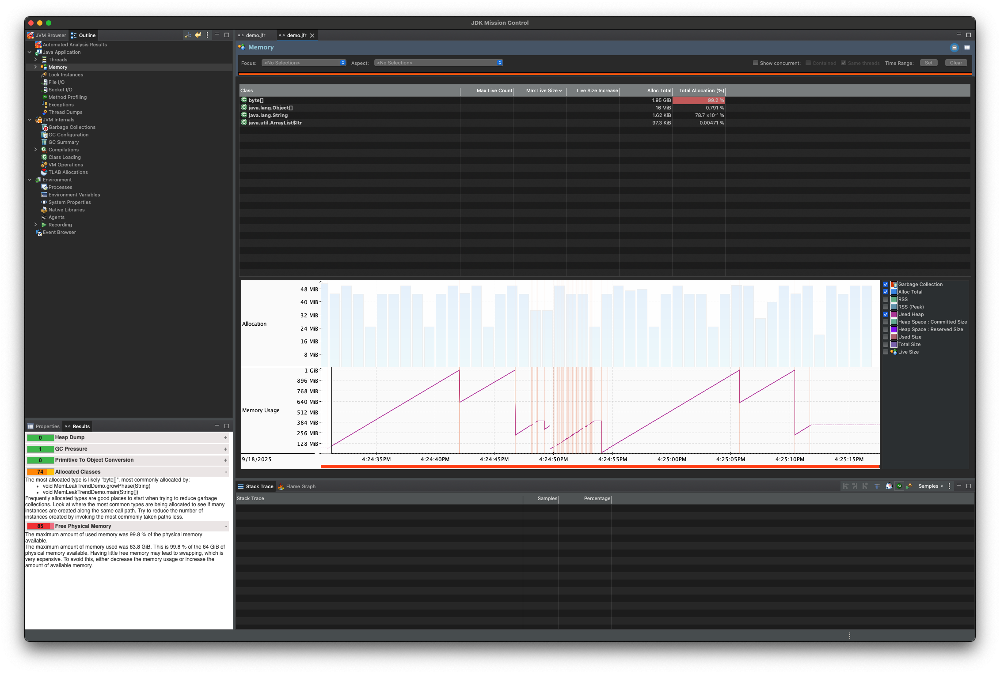
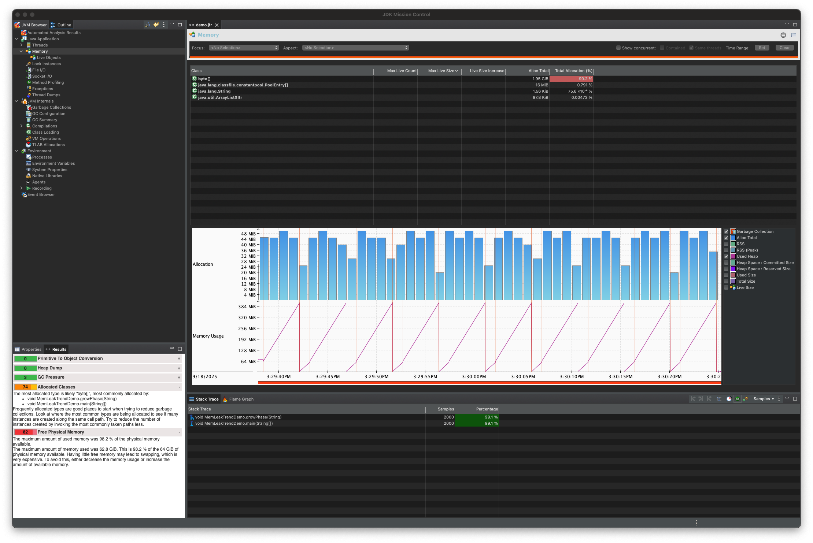

## How to use
1. Under this folder(JavaDemo), compile and run `javac JavaDemo.java && java JavaDemo`
2. Using JVM build-in tool to profile memory usage `java -XX:StartFlightRecording=filename=demo.jfr,dumponexit=true -Xms128m -Xmx1g -cp . JavaDemo`
3. Open jfr file with JMC(Java Mission Control)

## Result
> Let system decide when to collect the memory(Orange line is the GC event and it drop the memory used heap)

> Forcing Java GC to collect the memory
